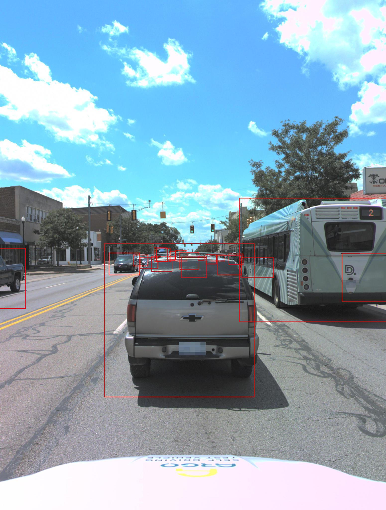
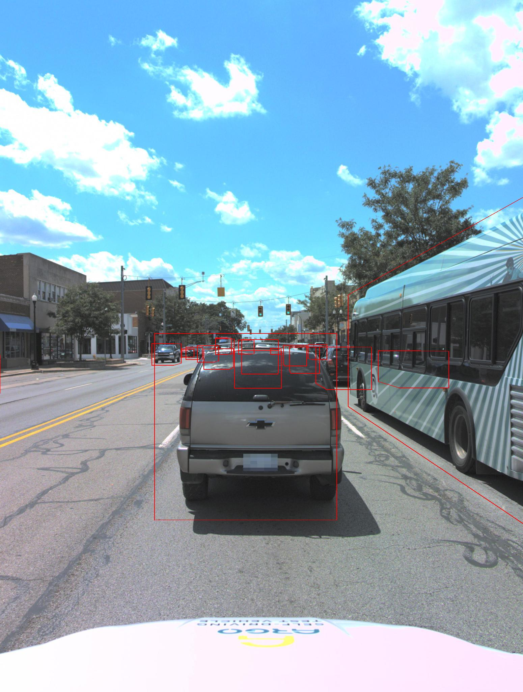
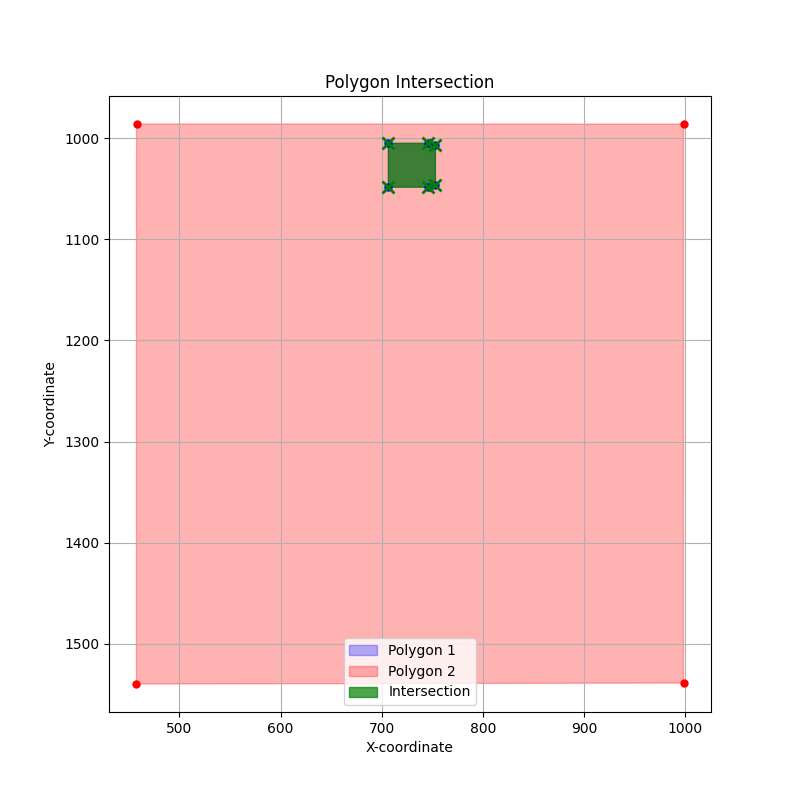

# debug_argoverse2
It is helpful to understand how the Argover v2 is structured, it only projects the 3d bounding boxes into 2D bounding boxes or convex hull as well, this is done __without__ using the [argoverse-api](https://github.com/argoverse/argoverse-api) because I had problems with the installation and it's possible to do three things:

- Project the 3D bounding boxes into 2D bounding boxes into the image plane.
- Project the 3D bounding boxes into 2D convex hulls or 2D bounding polygons.
- Compute the intersection among the 2D bounding polygons.

The bounding boxes are filtered by the field of view, which has been manually estimated, rather having a real value of it.

---

It has been tested __only on front camera__ and on the first chunk of the Argoverse V2 dataset (`train-000`), the files are large, this one is circa ~`56GB`. and you can easly find it in the [Argoverse V2 server](https://www.argoverse.org/av2.html#download-link) and download the link referring to `Train Part 1`. Check the code and modify accordingly to set your dataset directory.

## Projecting 2D Bounding Boxes

## Projecting 2D Convex Hulls (Bounding Polygons)

## Checking intersection among Bounding Polygons.

## Requirements in Python

- pandas
- matplolib
- PIL
- numpy
- scipy
